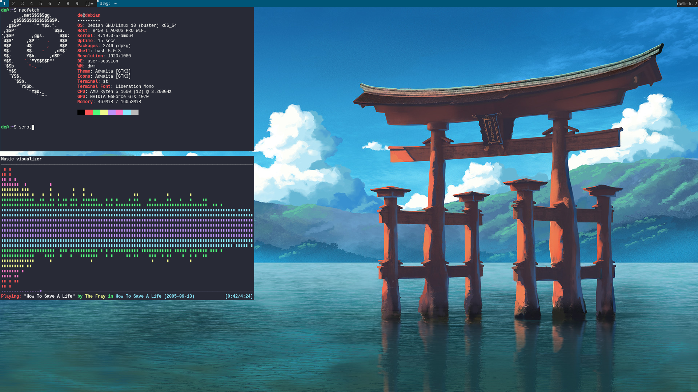

# dotfiles for a minimal suckless build on Debian 10

The main suckless tools used are `st` and `dwm`. 



### Instructions

```
sudo apt install  git stow

git clone https://github.com/alexhallam/dotfiles.git

cd dotfiles

stow bashrc nvim tmux mpd ncmpcpp xsession bashrc 

sudo apt-get install neovim tmux mpd ncmpcpp make build-essential libx11-dev libxft-dev libxinerama-dev xorg-dev sxhkd mpv pavucontrol

git clone https://git.suckless.org/dwm

cd dwm && sudo make install clean

git clone https://git.suckless.org/st

cd st && sudo make install clean

clone my st and dwm builds
```


# Other things to do when setting up a new OS

#### Neovim

- [ ] `sudo apt-get install neovim` https://github.com/neovim/neovim/wiki/Installing-Neovim

#### vim-plug

```
sh -c 'curl -fLo "${XDG_DATA_HOME:-$HOME/.local/share}"/nvim/site/autoload/plug.vim --create-dirs \
       https://raw.githubusercontent.com/junegunn/vim-plug/master/plug.vim'
```

### sxhd (simple x hotkey deamon)

```
sudo apt-get install sxhkd
```

### mpv

```
sudo apt-get install mpv
```

#### Brave Browser
```
https://brave-browser.readthedocs.io/en/latest/installing-brave.html#linux
```
